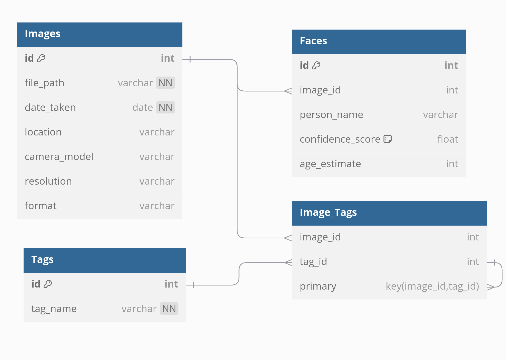

# Design Document

By SARATH KUMAR T

Video overview: <[URL HERE](https://youtu.be/eoeg2ex3fQo)>

## Scope

* Purpose of the Database: The purpose of this database is to manage and analyze image metadata, including visual characteristics, associated tags, and detected faces within images. This will facilitate efficient storage, retrieval, and organization of images based on their attributes and relationships.

* In-Scope Entities:

    * Images: The primary objects, containing information such as file path,    date taken, location, camera model, resolution, and format.
    * Tags: Descriptive keywords associated with images, such as "sunset," "portrait," "urban," etc.
    * Image_Tags: The associations between images and tags, allowing for multiple tags to be associated with a single image.
    * Faces: Information about detected faces within images, including person names, confidence scores, and age estimates.

* Out-of-Scope Entities:

    * Image editing or manipulation: The database does not store or manage edits made to images.
    * User authentication: The design does not include user management or authentication features.
    * Image storage: The actual images are not stored in the database; only metadata and associations are stored.

## Functional Requirements

* User Capabilities:

    * Users should be able to add new images along with their metadata.
    * Users should be able to tag images with descriptive keywords.
    * Users should be able to retrieve images based on various criteria, such as date, location, or tags.
    * Users should be able to update existing image metadata and tags.
    * Users should be able to delete images, tags, and associations.

* Beyond Scope:

    * Users will not be able to upload or edit the actual image files.
    * The database does not provide functionalities for image processing or analysis.

## Representation

### Entities

* Entities Chosen:

    * Images
    * Tags
    * Image_Tags
    * Faces

* Attributes:

    * Images:
        * id (INT, PRIMARY KEY, AUTO_INCREMENT)
        * file_path (VARCHAR(255), NOT NULL)
        * date_taken (DATE, NOT NULL)
        * location (VARCHAR(100))
        * camera_model (VARCHAR(100))
        * resolution (VARCHAR(20))
        * format (VARCHAR(50))

    * Tags:
        * id (INT, PRIMARY KEY, AUTO_INCREMENT)
        * tag_name (VARCHAR(50), NOT NULL, UNIQUE)

    * Image_Tags:
        * image_id (INT, FOREIGN KEY REFERENCES Images(id), ON DELETE CASCADE)
        * tag_id (INT, FOREIGN KEY REFERENCES Tags(id), ON DELETE CASCADE)

    * Faces:
        * id (INT, PRIMARY KEY, AUTO_INCREMENT)
        * image_id (INT, FOREIGN KEY REFERENCES Images(id))
        * person_name (VARCHAR(100))
        * confidence_score (FLOAT, CHECK (confidence_score >= 0 AND confidence_score <= 1))
        * age_estimate (INT)

* Chosen Types and Constraints:

    * The data types chosen are suitable for the nature of the data being stored, ensuring appropriate storage and retrieval efficiency. Constraints like NOT NULL and UNIQUE ensure data integrity and uniqueness where necessary.

### Relationships

* Entity Relationship Diagram:

* Relationships:

    * Each image can have multiple tags associated with it (many-to-many relationship via the Image_Tags table).
    * Each image can have multiple faces detected (one-to-many relationship with the Faces table).

## Optimizations

* Indexes Created:

    * Indexes on Images for quick lookups by date_taken and camera_model.
    * Indexes on Tags for fast searches by tag_name.
    * Combined indexes on Image_Tags to optimize joins between images and tags.
    * Indexes on Faces for quick searches by image_id and person_name.

* Views Created:

    * A view for retrieving all images along with their associated tags and detected faces for comprehensive data analysis

## Limitations
* Design Limitations:

    * The design does not account for storing actual image files; it focuses solely on metadata.
    * There are no built-in features for managing user permissions or authentication.

* Potential Representation Limitations:

    * The database may not efficiently represent complex relationships or hierarchies beyond the current structure.
    * It may struggle to represent multiple attributes for tags (e.g., category, description) within the current design.
